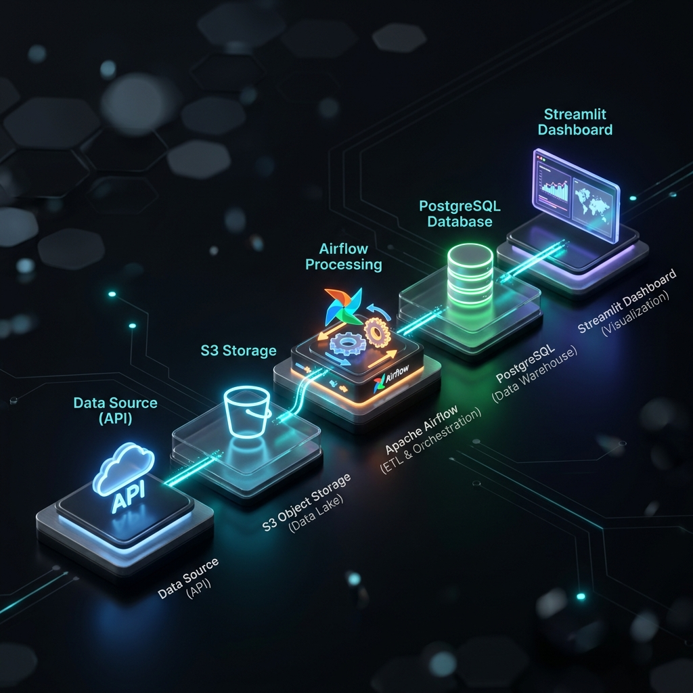
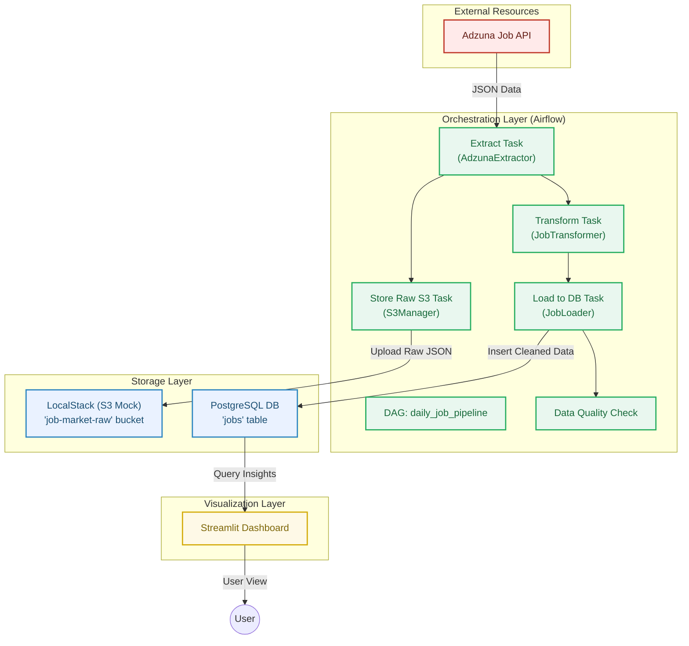

# System Architecture

This document provides a technical overview of the **Airflow Job Pipeline** architecture and data flow.

## High-Level Architecture Diagram

The system follows a standard ETL/ELT pattern using a Medallion-style approach (Raw -> Cleaned).

## Component Roles

### 1. Extraction (Bronze Layer)

* **Adzuna API**: External source for job listings.
* **LocalStack (S3)**: Acts as a staging area. Storing raw JSON ensures data lineage and allows for reconciliation or logic changes without losing historical data.

### 2. Transformation (Silver Layer)

* **Airflow Orchestrator**: Managed via the `daily_job_pipeline` DAG.
* **JobTransformer**: A Python utility that handles:
  * Missing data imputation.
  * Salary normalization (Min/Max to Average).
  * Removal of duplicate records.

### 3. Loading (Gold Layer)

* **PostgreSQL**: The production-ready database where cleaned data is structured for fast querying.
* **Data Quality Check**: An automated task that validates schema integrity and critical field presence before finalizing the load.

### 4. Presentation

* **Streamlit Dashboard**: A high-performance UI that visualizes trends, salary distributions, and job availability geographically.

---

## Infrastructure

The entire stack is containerized using **Docker Compose**, including:

* **Airflow Webserver/Scheduler**
* **PostgreSQL 15**
* **LocalStack** (for S3 API simulation)
* **Streamlit** (interactive dashboard)
